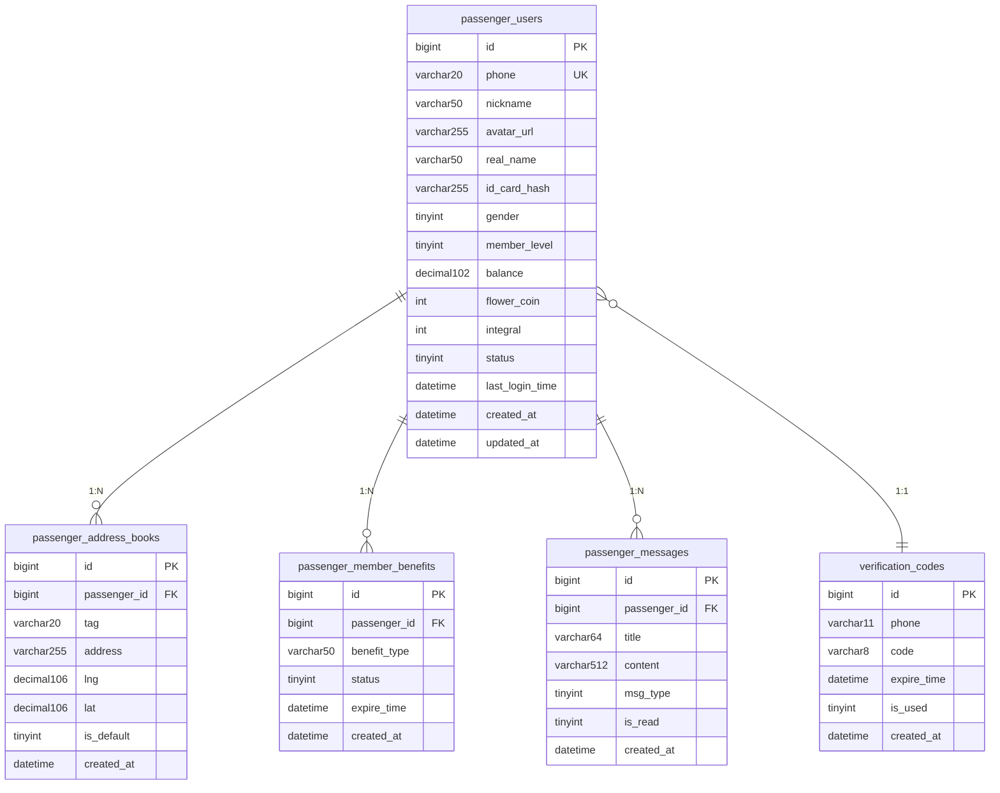
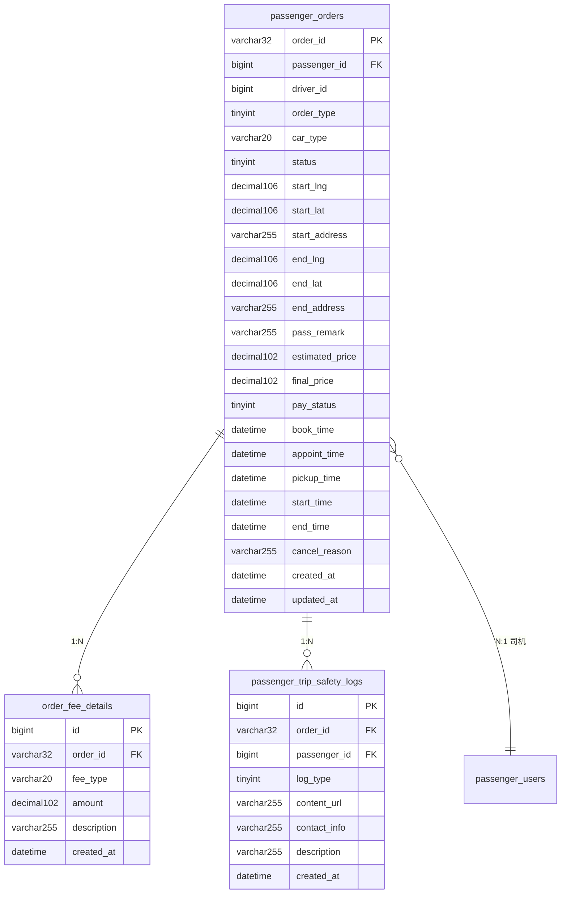
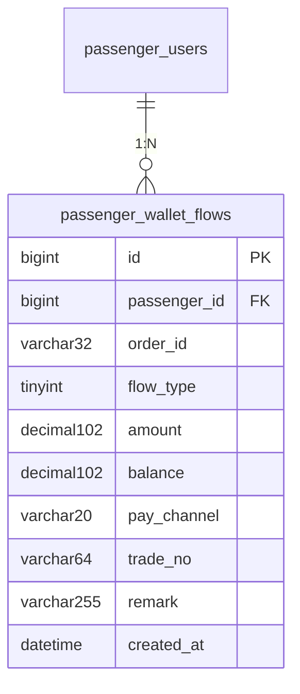
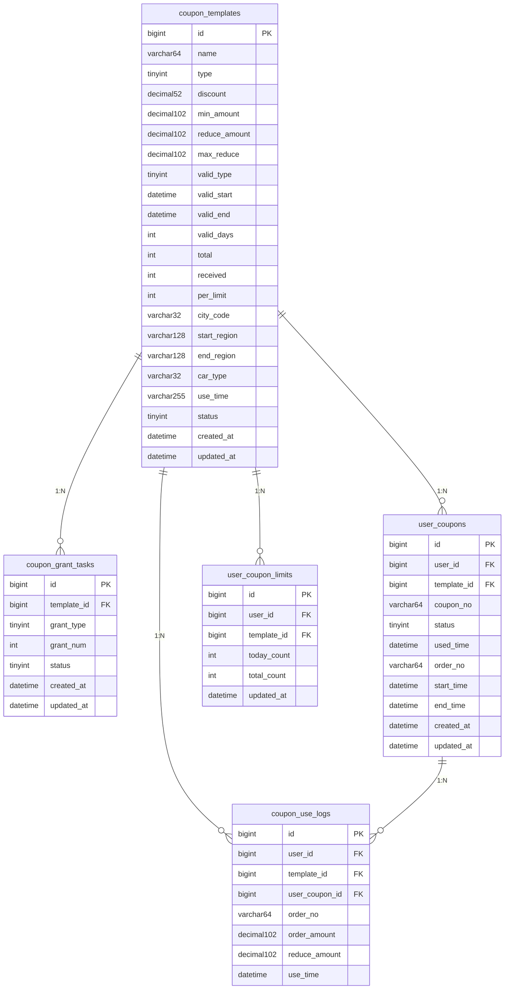
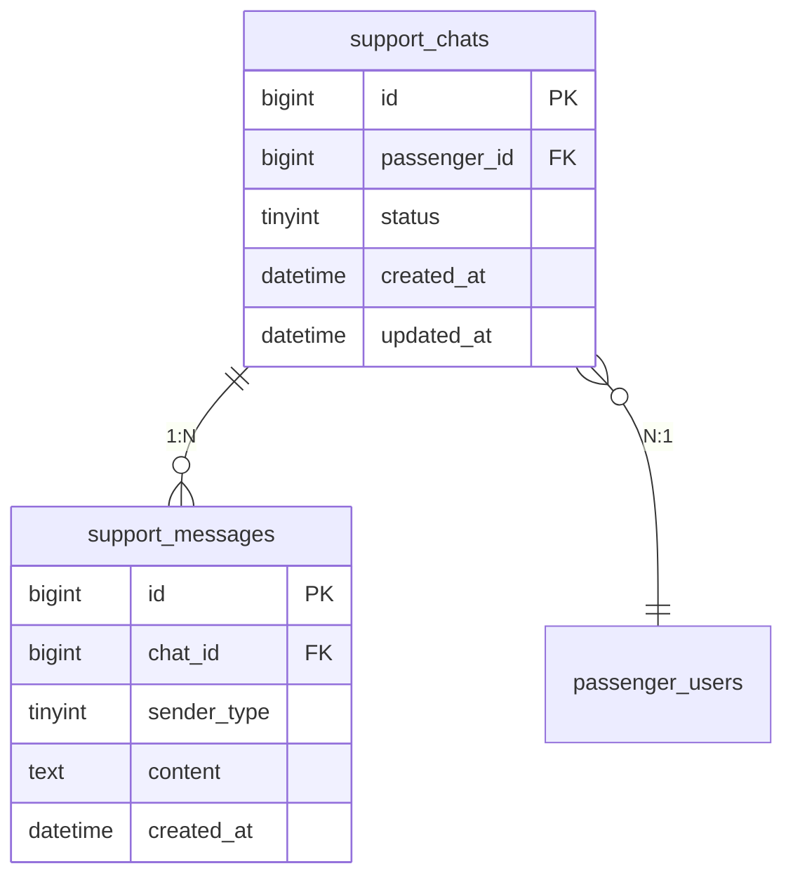

# user-srv 数据库 ER 关系图

---

## 📊 表清单总览

| 序号 | 表名 | 中文名称 | 字段数 | 核心业务 |
|------|------|----------|--------|----------|
| 1 | passenger_users | 乘客用户表 | 15 | 用户基础信息 |
| 2 | verification_codes | 验证码表 | 6 | 登录验证 |
| 3 | passenger_address_books | 地址簿表 | 9 | 常用地址 |
| 4 | passenger_member_benefits | 会员权益表 | 7 | 会员特权 |
| 5 | passenger_messages | 消息表 | 7 | 系统通知 |
| 6 | passenger_orders | 订单表 | 27 | 核心业务 |
| 7 | order_fee_details | 订单费用明细表 | 7 | 费用拆分 |
| 8 | passenger_trip_safety_logs | 行程安全记录表 | 8 | 安全保障 |
| 9 | passenger_wallet_flows | 钱包流水表 | 12 | 资金变动 |
| 10 | coupon_templates | 优惠券模板表 | 23 | 优惠券定义 |
| 11 | coupon_grant_tasks | 发放任务表 | 7 | 自动发放 |
| 12 | user_coupons | 用户优惠券表 | 12 | 已领券 |
| 13 | coupon_use_logs | 使用记录表 | 8 | 对账审计 |
| 14 | user_coupon_limits | 领券限制表 | 6 | 防刷机制 |
| 15 | support_chats | 客服会话表 | 6 | 在线客服 |
| 16 | support_messages | 客服消息表 | 6 | 会话消息 |

**总计**: 16 张表, 158+ 字段

---

## 🔗 完整 ER 关系图

```mermaid
erDiagram
    %% ==================== 核心用户模块 ====================
    
    passenger_users {
        bigint id PK "主键"
        varchar20 phone UK "手机号(唯一)"
        varchar50 nickname "昵称"
        varchar255 avatar_url "头像URL"
        varchar50 real_name "真实姓名"
        varchar255 id_card_hash "身份证号哈希"
        tinyint gender "性别 0-未知 1-男 2-女"
        tinyint member_level "会员等级 0-4"
        decimal102 balance "账户余额"
        int flower_coin "花小猪金币"
        int integral "积分数量"
        tinyint status "状态 1-正常 2-冻结 3-注销"
        datetime last_login_time "最后登录时间"
        datetime created_at "注册时间"
        datetime updated_at "更新时间"
    }
    
    verification_codes {
        bigint id PK
        varchar11 phone "手机号"
        varchar8 code "验证码"
        datetime expire_time "过期时间"
        tinyint is_used "是否已用 0-否 1-是"
        datetime created_at "创建时间"
    }
    
    passenger_address_books {
        bigint id PK
        bigint passenger_id FK "用户ID"
        varchar20 tag "地址标签"
        varchar255 address "详细地址"
        decimal106 lng "经度"
        decimal106 lat "纬度"
        tinyint is_default "是否默认 0-否 1-是"
        datetime created_at "创建时间"
    }
    
    passenger_member_benefits {
        bigint id PK
        bigint passenger_id FK "用户ID"
        varchar50 benefit_type "权益类型"
        tinyint status "状态 1-有效 2-已使用 3-已过期"
        datetime expire_time "过期时间"
        datetime created_at "获得时间"
    }
    
    passenger_messages {
        bigint id PK
        bigint passenger_id FK "用户ID"
        varchar64 title "消息标题"
        varchar512 content "消息内容"
        tinyint msg_type "消息类型"
        tinyint is_read "是否已读 0-否 1-是"
        datetime created_at "创建时间"
    }
    
    %% ==================== 订单模块 ====================
    
    passenger_orders {
        varchar32 order_id PK "订单ID(主键)"
        bigint passenger_id FK "乘客ID"
        bigint driver_id "司机ID(接单后填充)"
        tinyint order_type "类型 1-即时 2-预约 3-拼车"
        varchar20 car_type "车型"
        tinyint status "状态 1-6"
        decimal106 start_lng "起点经度"
        decimal106 start_lat "起点纬度"
        varchar255 start_address "起点地址"
        decimal106 end_lng "终点经度"
        decimal106 end_lat "终点纬度"
        varchar255 end_address "终点地址"
        varchar255 pass_remark "备注"
        decimal102 estimated_price "预估价"
        decimal102 final_price "最终价"
        tinyint pay_status "支付状态 0-4"
        datetime book_time "下单时间"
        datetime appoint_time "预约时间"
        datetime pickup_time "到达时间"
        datetime start_time "行程开始"
        datetime end_time "行程结束"
        varchar255 cancel_reason "取消原因"
        datetime created_at "创建时间"
        datetime updated_at "更新时间"
    }
    
    order_fee_details {
        bigint id PK
        varchar32 order_id FK "订单ID"
        varchar20 fee_type "费用类型"
        decimal102 amount "金额"
        varchar255 description "描述"
        datetime created_at "创建时间"
    }
    
    passenger_trip_safety_logs {
        bigint id PK
        varchar32 order_id FK "订单ID"
        bigint passenger_id FK "用户ID"
        tinyint log_type "类型 1-4"
        varchar255 content_url "内容URL"
        varchar255 contact_info "联系人"
        varchar255 description "事件描述"
        datetime created_at "创建时间"
    }
    
    %% ==================== 钱包模块 ====================
    
    passenger_wallet_flows {
        bigint id PK
        bigint passenger_id FK "用户ID"
        varchar32 order_id "订单ID"
        tinyint flow_type "类型 1-5"
        decimal102 amount "变动金额"
        decimal102 balance "变动后余额"
        varchar20 pay_channel "支付渠道"
        varchar64 trade_no "交易单号"
        varchar255 remark "备注"
        datetime created_at "交易时间"
    }
    
    %% ==================== 优惠券模块 ====================
    
    coupon_templates {
        bigint id PK
        varchar64 name "券名称"
        tinyint type "类型 1-4"
        decimal52 discount "折扣"
        decimal102 min_amount "门槛金额"
        decimal102 reduce_amount "减免额"
        decimal102 max_reduce "最高减免"
        tinyint valid_type "有效期类型 1-2"
        datetime valid_start "有效期始"
        datetime valid_end "有效期止"
        int valid_days "有效天数"
        int total "发放总量"
        int received "已领取"
        int per_limit "每人限领"
        varchar32 city_code "可用城市"
        varchar128 start_region "可用起点"
        varchar128 end_region "可用终点"
        varchar32 car_type "可用车型"
        varchar255 use_time "可用时段"
        tinyint status "状态 1-3"
        datetime created_at "创建时间"
        datetime updated_at "更新时间"
    }
    
    coupon_grant_tasks {
        bigint id PK
        bigint template_id FK "模板ID"
        tinyint grant_type "发放类型 1-4"
        int grant_num "每次发放张数"
        tinyint status "状态 0-1"
        datetime created_at "创建时间"
        datetime updated_at "更新时间"
    }
    
    user_coupons {
        bigint id PK
        bigint user_id FK "用户ID"
        bigint template_id FK "模板ID"
        varchar64 coupon_no "券编码"
        tinyint status "状态 1-4"
        datetime used_time "使用时间"
        varchar64 order_no "核销订单"
        datetime start_time "生效时间"
        datetime end_time "过期时间"
        datetime created_at "领取时间"
        datetime updated_at "更新时间"
    }
    
    coupon_use_logs {
        bigint id PK
        bigint user_id FK "用户ID"
        bigint template_id FK "模板ID"
        bigint user_coupon_id FK "用户券ID"
        varchar64 order_no "订单号"
        decimal102 order_amount "订单原价"
        decimal102 reduce_amount "减免金额"
        datetime use_time "使用时间"
    }
    
    user_coupon_limits {
        bigint id PK
        bigint user_id FK "用户ID"
        bigint template_id FK "模板ID"
        int today_count "今日领券数"
        int total_count "累计领券数"
        datetime updated_at "更新时间"
    }
    
    %% ==================== 客服模块 ====================
    
    support_chats {
        bigint id PK
        bigint passenger_id FK "用户ID"
        tinyint status "状态 1-进行中 2-已关闭"
        datetime created_at "创建时间"
        datetime updated_at "更新时间"
    }
    
    support_messages {
        bigint id PK
        bigint chat_id FK "会话ID"
        tinyint sender_type "发送者 1-用户 2-客服"
        text content "消息内容"
        datetime created_at "创建时间"
    }
    
    %% ==================== 定义关系 ====================
    
    %% 用户核心关系
    passenger_users ||--o{ passenger_address_books : "1:N 一个用户多个地址"
    passenger_users ||--o{ passenger_member_benefits : "1:N 用户拥有多个权益"
    passenger_users ||--o{ passenger_messages : "1:N 接收多条消息"
    passenger_users ||--o{ passenger_orders : "1:N 下多个订单"
    passenger_users ||--o{ passenger_wallet_flows : "1:N 多条资金流水"
    passenger_users ||--o{ support_chats : "1:N 多个客服会话"
    passenger_users ||--o{ user_coupons : "1:N 领取多张优惠券"
    passenger_users ||--o{ user_coupon_limits : "1:N 领券限制记录"
    passenger_users ||--o{ coupon_use_logs : "1:N 使用记录"
    passenger_users }o--|| verification_codes : "1:1 通过手机号关联"
    
    %% 订单关系
    passenger_orders ||--o{ order_fee_details : "1:N 多条费用明细"
    passenger_orders ||--o{ passenger_trip_safety_logs : "1:N 安全记录"
    passenger_orders }o--|| passenger_users : "N:1 司机接单(通过driver_id)"
    passenger_orders ||--o{ coupon_use_logs : "1:N 使用记录"
    passenger_orders ||--o{ passenger_wallet_flows : "1:N 支付流水"
    
    %% 优惠券体系关系
    coupon_templates ||--o{ coupon_grant_tasks : "1:N 多个发放任务"
    coupon_templates ||--o{ user_coupons : "1:N 生成多张用户券"
    coupon_templates ||--o{ coupon_use_logs : "1:N 使用记录"
    coupon_templates ||--o{ user_coupon_limits : "1:N 限制记录"
    
    %% 用户券关系
    user_coupons ||--o{ coupon_use_logs : "1:N 使用日志"
    user_coupons }o--|| passenger_users : "N:1 属于用户"
    user_coupons }o--|| coupon_templates : "N:1 来源于模板"
    
    %% 客服关系
    support_chats ||--o{ support_messages : "1:N 多条会话消息"
```



---

## 📐 分层 ER 图 (按业务域划分)

### 第一层：用户域



### 第二层：订单域



### 第三层：钱包域



### 第四层：优惠券域



### 第五层：客服域



---

## 🔍 关系详细说明

### 1️⃣ 一对一关系 (1:1)

| 主表 | 从表 | 关联字段 | 说明 |
|------|------|----------|------|
| `passenger_users` | `verification_codes` | `phone` | 通过手机号关联验证码 |

### 2️⃣ 一对多关系 (1:N)

#### 以 `passenger_users` 为中心的辐射关系:

| 从表 | 外键字段 | 业务含义 | 基数 |
|------|----------|----------|------|
| `passenger_address_books` | `passenger_id` | 用户常用地址 | 1:N |
| `passenger_member_benefits` | `passenger_id` | 会员权益记录 | 1:N |
| `passenger_messages` | `passenger_id` | 系统通知消息 | 1:N |
| `passenger_orders` | `passenger_id` | 历史订单 | 1:N |
| `passenger_wallet_flows` | `passenger_id` | 资金流水 | 1:N |
| `support_chats` | `passenger_id` | 客服会话 | 1:N |
| `user_coupons` | `user_id` | 已领优惠券 | 1:N |
| `user_coupon_limits` | `user_id` | 领券限制 | 1:N |
| `coupon_use_logs` | `user_id` | 券使用记录 | 1:N |

#### 以 `passenger_orders` 为中心的辐射关系:

| 从表 | 外键字段 | 业务含义 | 基数 |
|------|----------|----------|------|
| `order_fee_details` | `order_id` | 费用明细项 | 1:N |
| `passenger_trip_safety_logs` | `order_id` | 安全日志 | 1:N |
| `coupon_use_logs` | `order_no` | 券核销记录 | 1:N |
| `passenger_wallet_flows` | `order_id` | 支付流水 | 1:N |

#### 以 `coupon_templates` 为中心的辐射关系:

| 从表 | 外键字段 | 业务含义 | 基数 |
|------|----------|----------|------|
| `coupon_grant_tasks` | `template_id` | 发放任务 | 1:N |
| `user_coupons` | `template_id` | 用户券实例 | 1:N |
| `coupon_use_logs` | `template_id` | 使用记录 | 1:N |
| `user_coupon_limits` | `template_id` | 限制规则 | 1:N |

#### 其他一对多关系:

| 主表 | 从表 | 外键字段 | 说明 |
|------|------|----------|------|
| `support_chats` | `support_messages` | `chat_id` | 客服会话消息 |
| `user_coupons` | `coupon_use_logs` | `user_coupon_id` | 单券使用历史 |

### 3️⃣ 多对一关系 (N:1)

| 子表 | 父表 | 外键字段 | 说明 |
|------|------|----------|------|
| `passenger_orders` | `passenger_users`(司机) | `driver_id` | 司机接单 |
| `user_coupons` | `passenger_users` | `user_id` | 券归属用户 |
| `user_coupons` | `coupon_templates` | `template_id` | 券来源模板 |
| `passenger_trip_safety_logs` | `passenger_users` | `passenger_id` | 日志归属用户 |
| `support_chats` | `passenger_users` | `passenger_id` | 会话归属用户 |

---

## 📊 统计摘要

### 表关系统计

| 关系类型 | 数量 | 占比 |
|----------|------|------|
| 一对一 (1:1) | 1 | 4% |
| 一对多 (1:N) | 22 | 88% |
| 多对一 (N:1) | 2 | 8% |
| **总计** | **25** | **100%** |

### 各表关联度排名 (按外键连接数)

| 排名 | 表名 | 出度(作为父表) | 入度(作为子表) | 总关联数 |
|------|------|----------------|----------------|----------|
| 1 | `passenger_users` | 9 | 0 | **9** |
| 2 | `passenger_orders` | 4 | 1 | **5** |
| 3 | `coupon_templates` | 4 | 0 | **4** |
| 4 | `user_coupons` | 1 | 2 | **3** |
| 5 | `support_chats` | 1 | 1 | **2** |
| ... | 其他表 | 0-1 | 0-1 | 0-2 |

### 核心表识别

**高耦合表 (需重点关注)**:
- ⭐⭐⭐ `passenger_users` - 系统核心，9个直接关联
- ⭐⭐ `passenger_orders` - 业务核心，5个直接关联  
- ⭐⭐ `coupon_templates` - 优惠券核心，4个直接关联

**叶子表 (无出度)**:
- `verification_codes`, `passenger_address_books`, `passenger_member_benefits`
- `passenger_messages`, `order_fee_details`, `passenger_trip_safety_logs`
- `passenger_wallet_flows`, `coupon_grant_tasks`, `coupon_use_logs`
- `user_coupon_limits`, `support_messages`

---

## 💡 设计亮点与建议

### ✅ 设计亮点

1. **合理的垂直拆分**: 将订单、优惠券、客服等独立为不同业务域
2. **完整的时间追踪**: 所有表都有 `created_at`/`updated_at`
3. **灵活的优惠券系统**: 模板+实例+使用日志三层设计
4. **安全保障完善**: 行程安全日志独立存储

### 🔧 优化建议

1. **索引优化建议**:
   ```sql
   -- 高频查询字段加索引
   ALTER TABLE passenger_orders ADD INDEX idx_passenger_status (passenger_id, status);
   ALTER TABLE passenger_orders ADD INDEX idx_book_time (book_time);
   ALTER TABLE user_coupons ADD INDEX idx_user_status (user_id, status);
   ALTER TABLE user_coupons ADD INDEX idx_template (template_id);
   ```

2. **冗余字段考虑**:
   - `user_coupons` 可考虑增加 `template_name` 冗余，避免联表查询
   - `passenger_orders` 可缓存 `nickname` 提升列表性能

3. **分表策略**:
   - `passenger_orders`: 未来可按时间范围分表
   - `passenger_wallet_flows`: 大流量场景建议分库分表
   - `coupon_use_logs`: 归档表设计，定期清理历史数据

---

**文档版本**: v1.0  
**生成时间**: 2026-05-22 15:26  
**数据来源**: user-srv/model/*.go (16 files)  
**工具**: Mermaid ER Diagram
