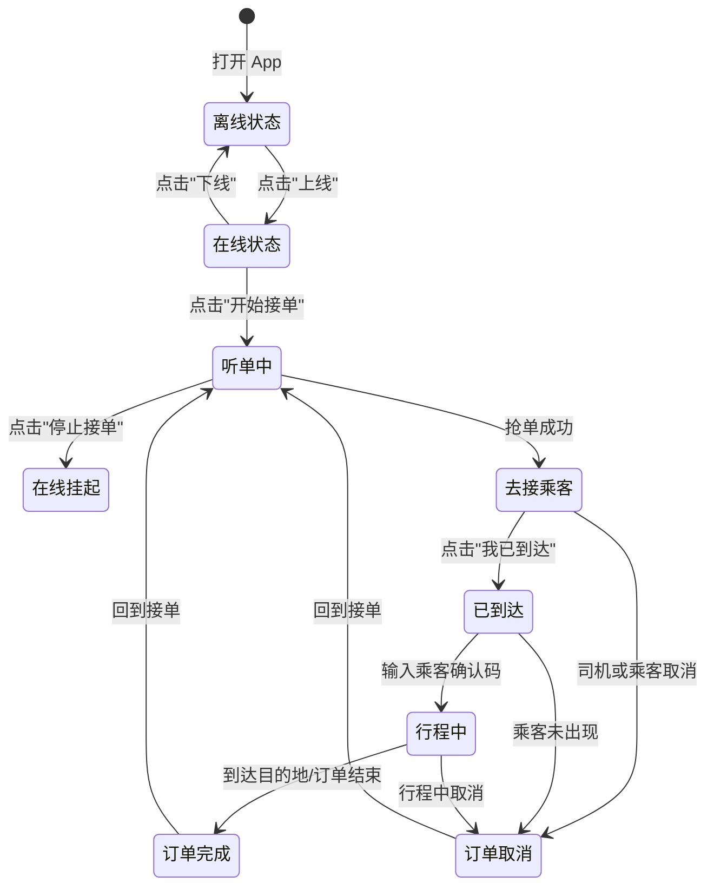
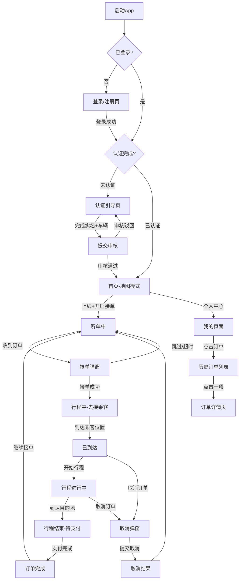
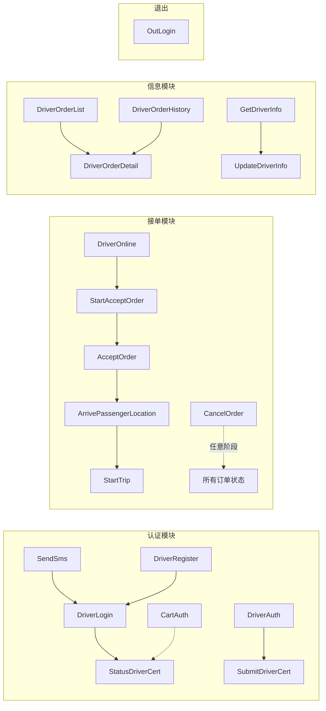

# 司机端 App — Stitch AI 页面设计需求规格说明书

> 本文档基于 `driver-srv` 后端 21 个 gRPC 接口及 17 张数据表反推产出，面向 Stitch AI 进行页面 UI/UX 设计。
> 文档版本：v1.0-draft

---

## 1. 文档概览

### 1.1 目标

为 Stitch AI 提供明确的司机端 App 页面设计需求，包括：
- 每个页面需展示的核心数据元素
- 页面间的导航与流转关系
- 关键操作的用户交互流程
- 状态机定义（订单状态、司机在线状态）
- **A 类页面**（当前接口可直接支撑）与 **B 类页面**（需补充接口后才可实现的候选功能）

### 1.2 技术约束

| 项目 | 说明 |
|------|------|
| 后端协议 | gRPC（protobuf 序列化） |
| 认证方式 | JWT Token（`DriverLogin` 接口返回，后续接口通过 token 鉴权） |
| 数据存储 | MySQL + Redis |
| 前端形态 | 移动端 App（司机端） |
| 定位服务 | 地图 SDK + 司机 GPS 坐标上报 |

### 1.3 状态码说明

#### 订单状态（`status` 字段）

| 值 | 含义 | 说明 |
|----|------|------|
| 1 | 待接单 | 乘客已下单，等待司机接单 |
| 2 | 已接单 | 司机已接单，前往乘客位置 |
| 3 | 已到达 | 司机已到达乘客上车点 |
| 4 | 行程中 | 乘客已上车，正在前往目的地 |
| 5 | 已完成 | 订单完成，等待支付/已支付 |
| 6 | 已取消 | 订单已被取消（司机/乘客） |

#### 司机在线状态（`online_status` / `accept_order`）

| online_status | accept_order | 含义 |
|---------------|--------------|------|
| 0 | 0 | 离线 |
| 1 | 0 | 在线（听单中·忙碌/暂停接单） |
| 1 | 1 | 在线并开启接单 |
| 1 | 2 | 接单中（已有订单进行中） |

#### 司机认证状态（`audit_status`）

| 值 | 含义 |
|----|------|
| 0 | 未认证/待提交 |
| 1 | 审核中 |
| 2 | 审核通过 |
| 3 | 审核驳回 |

---

## 2. 接口详细文档

> 以下列出全部 21 个 RPC 接口的请求/响应结构及业务规则。

### 2.1 认证与注册模块（8 个接口）

#### 2.1.1 SendSms — 发送短信验证码

```protobuf
// Request
message SendSmsReq {
  string phone = 1;  // 手机号
}
// Response
message SendSmsResp {
  bool success = 1;  // 是否发送成功
}
```

- **业务规则**：限制发送频率（60 秒内不可重复发送）
- **前端用途**：登录页/注册页"获取验证码"按钮

#### 2.1.2 DriverLogin — 司机登录

```protobuf
// Request
message DriverLoginReq {
  string phone = 1;  // 手机号
  string code = 2;  // 短信验证码
  int64 driverId = 3;  // 司机ID（注册后返回，首次登录为空）
}
// Response
message DriverLoginResp {
  int64 driverId = 1;     // 司机ID
  string token = 2;       // JWT Token
  int64 auditStatus = 3;  // 实名认证状态（0-未认证 1-审核中 2-已通过 3-驳回）
  int64 cartStatus = 4;   // 车辆认证状态
}
```

- **业务规则**：验证码正确后登录；新用户会自动注册
- **前端用途**：登录页，登录成功后根据 `auditStatus` / `cartStatus` 决定跳转首页或认证页

#### 2.1.3 OutLogin — 退出登录

```protobuf
// Request
message OutLoginReq {}
// Response
message OutLoginResp {
  bool success = 1;
}
```

- **前端用途**：个人中心 → 退出登录

#### 2.1.4 DriverAuth — 司机实名认证

```protobuf
// Request
message DriverAuthReq {
  string realName = 1;     // 真实姓名
  string iDCard = 2;       // 身份证号
  string iDCardFront = 3;  // 身份证正面照 URL
  string iDCardBack = 4;   // 身份证背面照 URL
  string licenseImg = 5;   // 驾驶证照片 URL
  string token = 6;        // JWT Token
}
// Response
message DriverAuthResp {
  string msg = 1;  // 提示信息
}
```

- **前端用途**：实名认证表单页

#### 2.1.5 CartAuth — 车辆认证

```protobuf
// Request
message CartAuthReq {
  string carPlate = 1;       // 车牌号
  string carModel = 2;       // 车型
  string drivingLicense = 3; // 行驶证照片 URL
  string token = 4;          // JWT Token
}
// Response
message CartAuthResp {
  string msg = 1;  // 提示信息
}
```

- **前端用途**：车辆认证表单页

#### 2.1.6 DriverRegister — 司机注册

```protobuf
// Request
message DriverRegisterReq {
  string phone = 1;     // 手机号
  string code = 2;      // 验证码
  string nickname = 3;  // 昵称
}
// Response
message DriverRegisterResp {
  int64 driverId = 1;  // 司机ID
}
```

- **前端用途**：新用户注册页

#### 2.1.7 SubmitDriverCert — 提交司机认证

```protobuf
// Request
message SubmitDriverCertReq {
  int64 driverId = 1;     // 司机ID
  string realName = 2;    // 真实姓名
  string licenseNo = 3;   // 驾驶证号
  string licenseExpire = 4; // 驾驶证有效期
  int64 driveYears = 5;   // 驾龄（年）
  int64 authType = 6;     // 认证类型
  string picURL = 7;      // 认证图片 URL
}
// Response
message SubmitDriverCertResp {
  bool success = 1;
}
```

- **前端用途**：认证资料提交页（与 `DriverAuth` 和 `CartAuth` 互补）

#### 2.1.8 StatusDriverCert — 查询认证状态

```protobuf
// Request
message StatusDriverCertReq {
  int64 driverId = 1;
}
// Response
message StatusDriverCertResp {
  int64 authType = 1;     // 认证类型
  int64 auditStatus = 2;  // 审核状态（0-未提交 1-审核中 2-通过 3-驳回）
  string reason = 3;      // 驳回原因
  string licenseNo = 4;   // 驾驶证号
  string realName = 5;    // 真实姓名
}
```

- **前端用途**：认证进度查询页；驳回后可查看原因并重新提交

---

### 2.2 接单与订单模块（11 个接口）

#### 2.2.1 DriverOnline — 司机上线

```protobuf
// Request
message DriverOnlineReq {
  int64 driverId = 1;
  Location driverLocation = 2;  // 当前位置（经纬度）
  int64 carStatus = 3;          // 车辆状态
  int64 onlineType = 4;         // 上线类型
}
// Response
message DriverOnlineResp {
  bool success = 1;
  string restReminder = 2;  // 休息提醒
}
```

- **业务规则**：将司机标记为在线状态，更新位置到 Redis Geo
- **前端用途**：首页"上线/下线"切换开关

#### 2.2.2 DriverOffline — 司机下线

```protobuf
// Request
message DriverOfflineReq {
  int64 driverId = 1;
  Location driverLocation = 2;
  int64 carStatus = 3;
}
// Response
message DriverOfflineResp {
  bool success = 1;
  string restReminder = 2;
}
```

- **前端用途**：首页"下线"按钮

#### 2.2.3 StartAcceptOrder — 开始接单

```protobuf
// Request
message StartAcceptOrderReq {
  int64 driverId = 1;
}
// Response
message StartAcceptOrderResp {
  bool success = 1;
}
```

- **业务规则**：只有在 `online_status = 1` 且 `accept_order = 0` 时可调用
- **前端用途**：首页"开始接单/停止接单"切换

#### 2.2.4 StopAcceptOrder — 停止接单

```protobuf
// Request
message StopAcceptOrderReq {
  int64 driverId = 1;
}
// Response
message StopAcceptOrderResp {
  bool success = 1;
}
```

- **前端用途**：同上，停止接收新订单推荐

#### 2.2.5 AcceptOrder — 抢单/接单

```protobuf
// Request
message AcceptOrderReq {
  int64 driverId = 1;
  string orderId = 2;
  int64 orderDistance = 3;         // 距乘客距离（米）
  Location driverCurrentLocation = 4;  // 当前位置
  string antiFraudToken = 5;       // 反作弊 Token
}
// Response
message AcceptOrderResp {
  bool success = 1;
  string orderLockTime = 2;  // 订单锁定时间（防止其他司机抢单）
}
```

- **业务规则**：抢单有反作弊校验，成功后会锁定订单一段时间
- **前端用途**：抢单弹窗/页（点击"接单"按钮）

#### 2.2.6 CancelOrder — 取消订单

```protobuf
// Request
message CancelOrderReq {
  int64 driverId = 1;
  string orderId = 2;
  string reason = 3;              // 取消原因
  string evidencePhoto = 4;       // 证据照片 URL
}
// Response
message CancelOrderResp {
  bool success = 1;
  float cancelFee = 2;            // 取消费用
  string cancelResponsibility = 3; // 责任方
  bool appealSupport = 4;         // 是否支持申诉
}
```

- **前端用途**：取消订单确认弹窗/页，选择原因并提交

#### 2.2.7 ArrivePassengerLocation — 到达乘客位置

```protobuf
// Request
message ArrivePassengerLocationReq {
  int64 driverId = 1;
  string orderId = 2;
  float arrivalAccuracy = 3;  // 到达精度（米）
  float driverLng = 4;
  float driverLat = 5;
  string arrivalPhoto = 6;    // 到达照片 URL
}
// Response
message ArrivePassengerLocationResp {
  bool success = 1;
}
```

- **前端用途**：行程中"我已到达"按钮，附带拍照确认

#### 2.2.8 StartTrip — 开始行程

```protobuf
// Request
message StartTripReq {
  int64 driverId = 1;
  string orderId = 2;
  float startOdometer = 3;         // 开始里程表读数（公里）
  string passengerConfirmCode = 4; // 乘客确认码（4位数字，乘客手机端可见）
  string pickupPhoto = 5;          // 接乘客照片 URL
}
// Response
message StartTripResp {
  bool success = 1;
}
```

- **前端用途**：输入乘客确认码 → 开始行程；需拍照留存

#### 2.2.9 DriverOrderList — 进行中订单列表

```protobuf
// Request
message DriverOrderListReq {
  int64 driverId = 1;
}
// Response
message DriverOrderListResp {
  string orderId = 1;
  int64 orderType = 2;          // 订单类型
  string carType = 3;           // 车型
  int64 status = 4;             // 订单状态
  string passengerName = 5;     // 乘客姓名
  string passengerPhone = 6;    // 乘客电话
  string passengerAvatar = 7;   // 乘客头像
  string startAddress = 8;      // 出发地址
  float startLng = 9;           // 出发经度
  float startLat = 10;          // 出发纬度
  string endAddress = 11;       // 目的地地址
  float endLng = 12;            // 目的地经度
  float endLat = 13;            // 目的地纬度
  string passRemark = 14;       // 乘客备注
  string bookTime = 15;         // 下单时间
  string pickupTime = 16;       // 接乘客时间
  string startTime = 17;        // 行程开始时间
  string driverRemark = 18;     // 司机备注
  int64 passengerRiskLevel = 19; // 乘客风险等级
  string estimatedArrivalTime = 20; // 预计到达时间
  float surgePrice = 21;        // 溢价金额
}
```

- **前端用途**：首页当前订单卡片（仅返回当前进行中的一条订单），显示导航信息

#### 2.2.10 DriverOrderDetail — 订单详情

```protobuf
// Request
message DriverOrderDetailReq {
  int64 driverId = 1;
  string orderId = 2;
}
// Response — 包含嵌套结构
message DriverIncomeDetailData {
  float totalFee = 1;         // 订单总金额
  float platformFee = 2;      // 平台抽成
  float actualIncome = 3;     // 实际收入
}
message DriverOrderDetailItem {
  string orderId = 1;
  int64 orderType = 2;
  string carType = 3;
  int64 status = 4;
  string startAddress = 5;
  float startLng = 6;
  float startLat = 7;
  string endAddress = 8;
  float endLng = 9;
  float endLat = 10;
  string passengerName = 11;
  string passengerPhone = 12;
  string passengerAvatar = 13;
  string passRemark = 14;
  float estimatedPrice = 15;       // 预估价格
  float finalPrice = 16;           // 最终价格
  float platformFee = 17;          // 平台抽成
  float actualIncome = 18;         // 实际收入
  string bookTime = 19;
  string pickupTime = 20;
  string startTime = 21;
  string endTime = 22;             // 订单结束时间
  string cancelReason = 23;        // 取消原因
  int64 payStatus = 24;            // 支付状态（0-未支付 1-已支付）
  string payType = 25;             // 支付方式
  string payTime = 26;             // 支付时间
  float couponDeduction = 27;      // 优惠券抵扣
  DriverIncomeDetailData driverIncomeDetail = 28;  // 收入详情
  int64 complaintStatus = 29;      // 投诉状态
  repeated string passengerTags = 30; // 乘客标签
}
message DriverOrderDetailResp {
  repeated DriverOrderDetailItem driverOrderDetailItem = 1;
}
```

- **前端用途**：订单详情页（行驶中/已完成/已取消 三个子态）

#### 2.2.11 DriverOrderHistory — 历史订单（带筛选）

```protobuf
// Request
message DriverOrderHistoryReq {
  int64 driverId = 1;
  int64 status = 2;              // 按订单状态筛选
  int64 payStatus = 3;           // 按支付状态筛选
  string searchKeyword = 4;      // 搜索关键词
  string startDate = 5;          // 开始日期
  string endDate = 6;            // 结束日期
  float minIncome = 7;           // 最小收入
  float maxIncome = 8;           // 最大收入
  int32 page = 9;                // 页码（分页）
  int32 size = 10;               // 每页条数
}
// Response
message DriverOrderHistoryItem {
  string orderId = 1;
  int64 orderType = 2;
  string carType = 3;
  int64 status = 4;
  string startAddress = 5;
  string endAddress = 6;
  float finalPrice = 7;
  float actualIncome = 8;
  string bookTime = 9;
  string endTime = 10;
  int64 payStatus = 11;
  float serviceScore = 12;       // 服务分
}
message DriverOrderHistoryResp {
  repeated DriverOrderHistoryItem driverOrderHistoryItem = 1;
  int64 total = 2;               // 总记录数
}
```

- **前端用途**：历史订单列表页（支持日期/状态/收入范围筛选、关键词搜索、分页）

---

#### 2.2.12 缺失接口说明 — 当前 proto 未定义，页面设计需预留

> 以下接口在数据库中有对应表，但当前 proto 中尚未定义，驱动前端对应的功能。页面设计时应预留交互位置，后续补充后端接口后即可对接。

| 缺失接口 | 预期功能 | 关联数据表 | 影响页面 |
|----------|----------|-----------|----------|
| **EndTrip**（结束行程） | 司机到达目的地后确认行程结束，上传结束里程、到达照片 | 订单表 | P07 行程中页 → "结束行程"按钮 |
| **GetRecommendOrders**（待推荐订单查询） | 获取附近可抢的订单列表（或通过 WebSocket 推送） | `driver_order_recommends` | P04 抢单弹窗 → 订单推荐数据源 |

**推荐的前端实现方案**：订单推荐建议使用 **WebSocket 长连接**实现实时推送，避免轮询延迟。当后端有新订单推荐时，通过 WebSocket 下发订单摘要数据，前端弹出抢单窗口。`AcceptOrder` 接口作为抢单确认的最终回调。

---

### 2.3 司机信息模块（2 个接口）

#### 2.3.1 GetDriverInfo — 获取司机信息

```protobuf
// Request
message GetDriverInfoReq {
  int64 driverID = 1;
}
// Response
message GetDriverInfoResp {
  int64 driverID = 1;
  string phone = 2;           // 手机号
  string realName = 3;        // 真实姓名
  int64 authType = 4;         // 认证类型
  int64 auditStatus = 5;      // 审核状态
  string licenseNo = 6;       // 驾驶证号
  string licenseExpire = 7;   // 驾驶证有效期
  int64 driveYears = 8;       // 驾龄
}
```

- **前端用途**：个人中心页、认证状态页

#### 2.3.2 UpdateDriverInfo — 更新司机信息

```protobuf
// Request
message UpdateDriverInfoReq {
  int64 driverID = 1;
  string nickname = 2;   // 昵称
  string avatarURL = 3;  // 头像 URL
}
// Response
message UpdateDriverInfoResp {
  bool success = 1;
}
```

- **前端用途**：编辑个人资料页

---

## 3. 页面地图与接口映射

### 3.1 A 类页面（当前接口可直接支撑）

| 序号 | 页面名称 | 涉及接口 | 优先级 |
|------|----------|----------|--------|
| P01 | 登录/注册页（一体化） | SendSms, DriverLogin | P0 — MVP |
| P02 | 首页（地图模式） | DriverOnline, DriverOffline, StartAcceptOrder, StopAcceptOrder, DriverOrderList | P0 — MVP |
| P03 | 抢单弹窗 | AcceptOrder | P0 — MVP |
| P04 | 行程中页（去接乘客） | DriverOrderList(当前订单), ArrivePassengerLocation, DriverOrderDetail | P0 — MVP |
| P05 | 行程中页（已到达） | ArrivePassengerLocation, StartTrip | P0 — MVP |
| P06 | 行程中页（行程中） | StartTrip, DriverOrderDetail | P0 — MVP |
| P07 | 取消订单弹窗 | CancelOrder | P0 — MVP |
| P08 | 订单详情页 | DriverOrderDetail | P0 — MVP |
| P09 | 历史订单列表 | DriverOrderHistory | P1 |
| P10 | 个人中心/我的 | GetDriverInfo, UpdateDriverInfo, OutLogin | P1 |
| P11 | 实名认证页 | DriverAuth, SubmitDriverCert, StatusDriverCert | P0 — 新司机必走 |
| P12 | 车辆认证页 | CartAuth | P0 — 新司机必走 |
| P13 | 设置页 | 无特殊接口需求（纯前端页面） | P2 |

### 3.2 B 类页面（需补充接口后才可实现）⚠️

| 序号 | 页面名称 | 缺失接口 | 数据表情况 | 优先级建议 |
|------|----------|----------|------------|------------|
| B01 | 钱包/余额页 | 无查询余额接口、无充值提现接口 | `driver_wallets` 表已存在 | 迭代 1 |
| B02 | 收入统计页 | 无收入统计/趋势接口 | `driver_incomes` 表已存在 | 迭代 1 |
| B03 | 提现页 | 无提现发起/查询接口 | `driver_withdraws` 表已存在 | 迭代 2 |
| B04 | 消息中心 | 无消息列表/已读/删除接口 | `driver_messages` 表已存在 | 迭代 2 |
| B05 | 违规记录页 | 无违规查询接口 | `driver_violations` 表已存在 | 迭代 2 |

---

## 4. 页面详细设计需求（Stitch AI 重点关注）

> 以下按 A 类页面逐页描述。每页包含：**页面元素**、**状态说明**、**交互流程**。

---

### 4.1 P01 — 登录/注册页（一体化）

> 登录与注册已合并为同一流程（后端 `DriverLogin` 支持新用户自动注册），无需独立注册页。`DriverRegister` 接口单独存在，可作为新用户首次注册时额外填写昵称的扩展入口。

#### 页面元素

| 元素 | 类型 | 数据来源 | 说明 |
|------|------|----------|------|
| 手机号输入框 | Input | 用户输入 | 11 位手机号格式校验 |
| 获取验证码按钮 | Button | SendSms | 点击后倒计时 60s，禁用状态 |
| 验证码输入框 | Input | 用户输入 | 6 位数字 |
| 登录/注册按钮 | Button | DriverLogin | 新用户自动注册，老用户直接登录 |
| 用户协议&隐私政策 | Link | 静态 | 底部文案 |

#### 状态说明

- **默认态**：手机号输入框 + 验证码输入框空，获取验证码按钮可点击
- **验证码发送中**：按钮变为 "60s 后可重新获取"，倒计时递减
- **登录请求中**：按钮 Loading 态
- **登录成功**：跳转到首页或认证引导页（根据 `auditStatus`）
- **登录失败（验证码错误）**：Toast "验证码错误，请重新输入"
- **登录失败（网络异常）**：Toast "网络异常，请稍后重试"

#### 交互流程

```
用户输入手机号 → 点击"获取验证码"(SendSms) → 按钮倒计时 60s →
输入验证码 → 点击"登录" →
  ├─ 新用户: 调用 DriverLogin(driverId=空) → 自动注册 → 获得 driverId + token
  └─ 老用户: 调用 DriverLogin(driverId=已有) → 返回 token
→ 判断 auditStatus:
  ├─ 0(未认证): 跳转认证引导页
  ├─ 1(审核中): 跳转首页，Toast 提示"您的认证正在审核中"
  └─ 2/其他: 直接跳转首页
```

---

### 4.2 P03 — 首页（地图模式）

> 这是司机端最核心的页面，所有接单操作均在此发生。

#### 页面元素

| 元素 | 类型 | 数据来源 | 说明 |
|------|------|----------|------|
| 地图区域 | MapView | 地图SDK | 全屏地图背景 |
| 司机位置标记 | Marker | GPS | 实时更新 |
| 订单入口/状态卡片 | Card | DriverOrderList | 有订单时显示，无订单时隐藏 |
| 上线/下线开关 | Toggle | DriverOnline/Offline | 大按钮，居中底部 |
| 开始/停止接单 | Toggle | StartAcceptOrder/StopAcceptOrder | 上线后可见 |
| 订单推荐弹窗（抢单） | Modal | 推送/轮询 | 收到新订单推荐时弹出 |
| 导航栏 | NavBar | 静态 | 左侧:消息图标 右侧:个人中心 |

#### 状态机（首页核心状态流转）



#### 首页无订单时的交互过程

```
用户上线并开启接单 →
  后端推送附近订单 →
  弹出抢单窗口（10-15秒倒计时）→
    点击"接单" → AcceptOrder → 进入"去接乘客"状态
    倒计时结束 → 等待下一单
```

#### 抢单弹窗（P04）元素

| 元素 | 说明 |
|------|------|
| 乘客上车点 | 地址文字 + 地图小图标注 |
| 乘客目的地 | 地址文字 |
| 距您距离 | 订单距离（米） |
| 预估价格 | 显示金额 |
| 接单按钮 | 大按钮 + 倒计时 |
| 跳过按钮 | 放弃此单 |

---

### 4.3 P05 — 行程中页（去接乘客）

#### 页面元素

| 元素 | 数据来源 | 说明 |
|------|----------|------|
| 导航状态 | DriverOrderList | 显示从司机位置到乘客上车点的导航路线 |
| 乘客信息卡片 | DriverOrderList | 乘客头像、姓名(脱敏)、电话、备注 |
| 出发地→目的地 | DriverOrderList | 起点地址箭头指向终点地址 |
| 预计到达时间 | DriverOrderList.estimatedArrivalTime | 倒计时显示 |
| "我已到达"按钮 | 手动触发 → ArrivePassengerLocation | 大按钮，需要拍照 |
| 联系乘客 | 呼叫/IM | 点击触发电话 App |
| 取消订单 | 弹窗 → CancelOrder | 右上角更多菜单 |

#### 交互流程

```
查看导航 → 到达乘客位置附近 →
点击"我已到达" → (可选:拍照) → 确认到达 →
状态变为"已到达" → 等待乘客上车 →
乘客上车后输入乘客确认码 → 点击"开始行程" →
调用 StartTrip → 进入"行程中"状态
```

---

### 4.4 P07 — 行程中页（行程进行中）

#### 页面元素

| 元素 | 数据来源 | 说明 |
|------|----------|------|
| 导航到目的地 | 地图 SDK + DriverOrderList | 实时导航 |
| 行程信息 | DriverOrderDetail | 行驶距离、时长、预估费用 |
| 乘客信息 | DriverOrderDetail | 姓名(脱敏)、电话 |
| 结束行程按钮 | 手动触发 | 到达目的地后点击（当前接口无 EndTrip，需后续补充） |

---

### 4.5 P08 — 取消订单弹窗

#### 页面元素

| 元素 | 类型 | 说明 |
|------|------|------|
| 取消原因列表 | RadioGroup | 预设选项(如：乘客取消/交通管制/车辆故障 等) |
| 其他原因输入 | TextArea | 选"其他"时显示 |
| 证据拍照 | Camera | 可选上传 |
| 提交按钮 | Button | → CancelOrder |
| 返回结果 | Toast | 显示取消费用和责任方 |

#### 交互流程

```
点击"取消订单" → 弹窗选择原因 →
可选拍照上传证据 → 提交 →
CancelOrder 返回 cancelFee, cancelResponsibility →
Toast 提示: "取消费用 X 元，责任方: 司机/乘客"
若 appealSupport == true → 显示"去申诉"入口
```

---

### 4.6 P09 — 订单详情页

> 根据订单 `status` 显示不同布局：已完成、进行中、已取消。

#### 已完成订单详情

| 区域 | 内容 | 数据来源 |
|------|------|----------|
| 顶部状态区 | "已完成" + 支付状态标签 | status + payStatus |
| 行程路线 | 起点→终点，中间路径 | startAddress → endAddress |
| 乘客信息 | 头像、姓名、电话 | passengerName, passengerPhone, passengerAvatar |
| 时间线 | 接单时间→到达时间→开始时间→完成时间 | bookTime→pickupTime→startTime→endTime |
| 费用明细 | 总金额、平台抽成、实际收入、优惠券抵扣 | DriverIncomeDetail |
| 附加信息 | 取消原因(如已取消)、投诉状态、乘客标签 | cancelReason, complaintStatus, passengerTags |
| 操作按钮 | "再来一单"（仅已完成时显示） | 纯前端 |

---

### 4.7 P10 — 历史订单列表

#### 页面元素

| 元素 | 类型 | 说明 |
|------|------|------|
| 筛选栏 | FilterBar | 日期范围选择器 |
| 筛选项 | Segment/Tab | 全部 / 已完成 / 已取消 |
| 收入范围 | 可选筛选 | 最低收入~最高收入 |
| 搜索框 | SearchBar | 关键词搜索（地址等） |
| 订单卡片列表 | List | 分页加载，滚动到底部自动加载下一页 |
| 卡片内容 | — | 起点→终点、金额、时间、状态标签 |

#### 分页逻辑

```
请求参数: page=1, size=20
响应: items[] + total
加载更多: page++，追加数据
```

---

### 4.8 P11 — 个人中心/我的

#### 页面元素

| 区域 | 内容 | 交互 |
|------|------|------|
| 顶部头像区 | 头像 + 昵称 + 手机号 | 点击 → 编辑资料页 |
| 认证状态 | 实名认证状态 + 车辆认证状态 | 点击 → 认证详情/重新提交 |
| 统计信息 | 服务分、订单数 | 只读展示 |
| 功能列表 | 历史订单 / 设置 | 点击跳转 |
| 退出登录 | 退出按钮 | → OutLogin → 回到登录页 |

---

### 4.9 P12/P13 — 认证流程页（实名认证 + 车辆认证）

#### 认证引导页（登录后首次进入）

```
DriverLoginResp.auditStatus == 0 时跳转:
  ┌─────────────────────────────────┐
  │  欢迎加入平台                   │
  │  完成以下认证即可开始接单       │
  │                                 │
  │  ✅ ① 实名认证  → 点击前往     │
  │  ⬜ ② 车辆认证  → 点击前往     │
  │                                 │
  │  [提交审核] 按钮（全部完成可点）│
  └─────────────────────────────────┘
```

#### 实名认证页（P12）

| 表单字段 | 组件 | 说明 |
|----------|------|------|
| 真实姓名 | TextInput | 与身份证一致 |
| 身份证号 | TextInput | 18 位，前端校验格式 |
| 身份证正面 | ImageUpload | 拍照或相册 |
| 身份证反面 | ImageUpload | 拍照或相册 |
| 驾驶证照片 | ImageUpload | 拍照或相册 |

#### 车辆认证页（P13）

| 表单字段 | 组件 | 说明 |
|----------|------|------|
| 车牌号 | TextInput | 格式校验 |
| 车型 | Picker/Select | 选择品牌 → 型号 |
| 行驶证照片 | ImageUpload | 拍照或相册 |

#### 认证状态页

```
调用 StatusDriverCert → 
  auditStatus == 1 → 展示"审核中"进度条
  auditStatus == 2 → 展示"已通过"图标
  auditStatus == 3 → 展示"驳回" + reason + 重新提交按钮
```

---

## 5. 全局交互规范

### 5.1 导航结构

```
Tab 底部导航栏（2 个 Tab）:
  ├─ Tab 1: 首页（接单地图）
  └─ Tab 2: 我的（个人中心）

非 Tab 页面（从首页/个人中心 Push 进入）:
  ├─ 订单详情页
  ├─ 历史订单列表
  ├─ 实名认证页
  ├─ 车辆认证页
  ├─ 认证状态页
  ├─ 编辑资料页
  └─ 设置页（B 类，迭代加入）

Modal 弹窗（从首页唤起）:
  ├─ 抢单弹窗
  └─ 取消订单弹窗
```

### 5.2 全屏交互流程总览（Mermaid）



### 5.3 全局状态管理

| 状态 | 存储位置 | 更新时机 | 影响范围 |
|------|----------|----------|----------|
| 登录 Token | LocalStorage/SecureStore | 登录/注册成功 | 全部需要鉴权的请求 |
| 司机在线状态 | 全局 Store | DriverOnline/Offline | 首页 UI、订单推荐 |
| 接单状态 | 全局 Store | StartAcceptOrder/StopAcceptOrder | 首页接单开关、订单推荐 |
| 当前订单 | 全局 Store | 定时轮询 DriverOrderList | 首页状态卡片 |
| 认证状态 | 全局 Store | 启动时/认证通过时 | 导航守卫、认证页 |

### 5.4 错误/异常处理规范

| 场景 | UI 表现 | 说明 |
|------|---------|------|
| 网络超时 | Toast "网络异常，请检查网络连接" | 自动重试 2 次 |
| Token 过期 | 自动跳转登录页 | 401 统一拦截 |
| 抢单失败（已被抢） | Toast "订单已被其他司机接走" + 关闭弹窗 | 回到听单状态 |
| 取消失败 | Toast "取消失败，请重试" | — |
| 认证驳回 | 认证状态页展示驳回原因 + 重新提交入口 | 用户可修改后重提 |

---

## 6. 推荐设计参考与注意事项

### 6.1 行业参考产品

- **滴滴出行·司机端**：地图模式接单、抢单弹窗、行程进度状态
- **高德地图·司机版**：导航集成、订单卡片、收入统计

### 6.2 Stitch AI 设计注意事项

1. **地图作为核心交互空间** — 首页地图需要适应 3 种以上模式（离线/听单/行程中），不同模式地图上的 UI 覆盖元素不同
2. **状态驱动 UI** — 订单的 6 种状态 + 司机 4 种在线状态，需要为每种组合设计对应的 UI 布局
3. **有状态颜色规范** — 建议使用统一的色彩语义：绿色(上线/接单/成功)、红色(下线/取消/异常)、蓝色(导航/信息)
4. **驾驶友好设计** — 按钮尺寸应足够大（建议最小触控 44pt），关键操作防止误触
5. **B 类页面的位置预留** — 底部导航栏或首页预留"消息"、"钱包"入口（当前可灰显或文案说明即将上线）

---

## 附录 A：数据表结构参考

### driver_users（司机用户表）

| 字段 | 类型 | 说明 |
|------|------|------|
| id | bigint | 主键 |
| phone | varchar(11) | 手机号 |
| nickname | varchar(32) | 昵称 |
| avatar_url | varchar(255) | 头像URL |
| service_score | decimal(3,2) | 服务分(0.00-5.00) |
| order_count | bigint | 订单总数 |

### driver_vehicles（车辆信息）

| 字段 | 类型 | 说明 |
|------|------|------|
| plate_no | varchar(16) | 车牌号 |
| brand | varchar(32) | 品牌 |
| model | varchar(32) | 型号 |
| color | varchar(16) | 颜色 |

### driver_online_status（在线状态）

| 字段 | 类型 | 说明 |
|------|------|------|
| online_status | tinyint | 0-离线 1-在线 |
| accept_order | tinyint | 0-停止接单 1-开始接单 2-接单中 |
| lng | decimal(10,6) | 经度 |
| lat | decimal(10,6) | 纬度 |

---

## 附录 B：接口调用关系总图（Mermaid）


